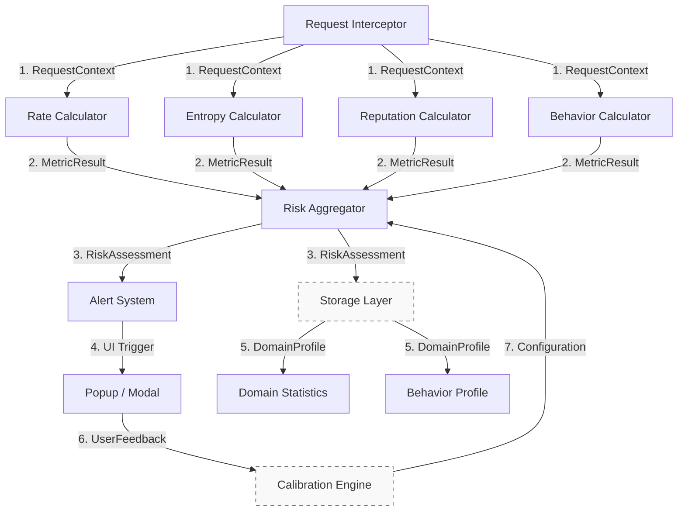
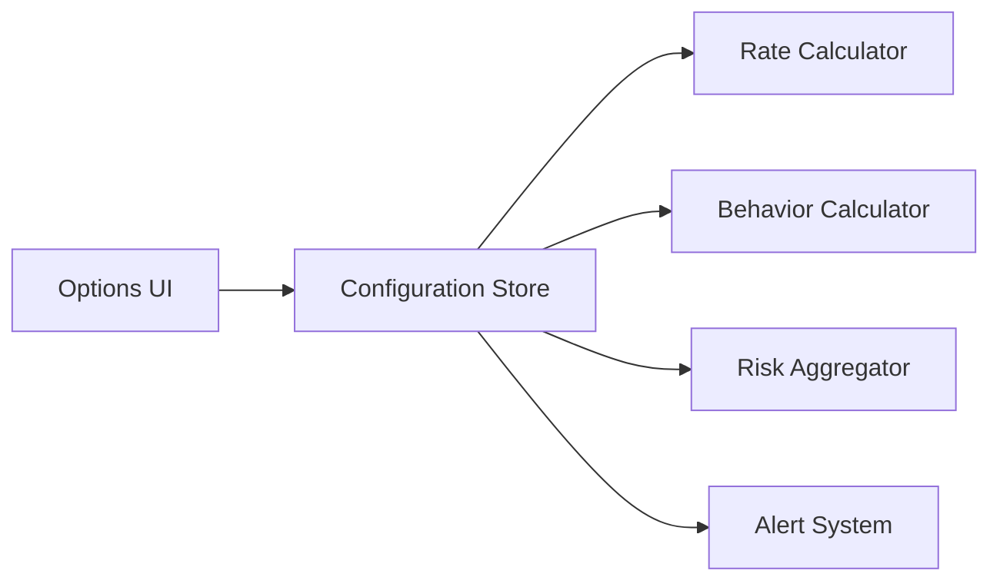

# Component Interactions — Event Contracts

**Formal definition of data exchange between system components**  
**No code, only message contracts, triggers, and dependencies**

---

## Interaction Model

---

## Message Contracts

| # | Message | From → To | Payload | Sync/Async |
|---|--------|----------|--------|------------|
| 1 | `RequestContext` | Interceptor → Calculators | `api/request-context.api.md` | Sync |
| 2 | `MetricResult` | Calculator → Aggregator | `api/metric-result.api.md` | Sync |
| 3 | `RiskAssessment` | Aggregator → Alert/Storage | `api/risk-assessment.api.md` | Sync (Alert), Async (Storage) |
| 4 | `UI Trigger` | Alert System → UI | `{ level, domain, reasoning }` | Sync |
| 5 | `Profile Update` | Aggregator → Storage | `DomainStats`, `BehaviorProfile` | Async |
| 6 | `UserFeedback` | UI → Calibration | `{ domain, decision: 'allow'|'block', timestamp }` | Async |
| 7 | `WeightUpdate` | Calibration → Aggregator | `{ weights: [w1,w2,w3,w4] }` | Async |

---

## Event Triggers

| Event | Source | Target | Condition |
|------|--------|--------|---------|
| **DNS Request** | `webRequest` | Interceptor | `onBeforeRequest` |
| **Analysis Complete** | Aggregator | Alert System | `R` and `level` computed |
| **User Action** | UI | Calibration | Override or dismiss |
| **Storage Flush** | Background | Storage | Every 100 updates or 5 min |
| **Config Change** | Options UI | All Calculators | `configuration-store` update |

---

## Dependency Matrix

| Component | Depends On | Provides To |
|---------|------------|------------|
| **Request Interceptor** | `webRequest API` | All Calculators |
| **Rate Calculator** | `Storage`, `Config` | Aggregator |
| **Entropy Calculator** | `Config` | Aggregator |
| **Reputation Calculator** | `External APIs`, `Cache` | Aggregator |
| **Behavior Calculator** | `Storage`, `Config` | Aggregator |
| **Risk Aggregator** | 4 Calculators, `Weights` | Alert, Storage |
| **Alert System** | Aggregator | UI Components |
| **Storage Layer** | Aggregator, Calculators | All Calculators |
| **Calibration Engine** | UI Feedback | Aggregator |

---

## Timing & Ordering

| Phase | Components | Parallel? | Required Order |
|------|-----------|----------|----------------|
| **Interception** | Interceptor | No | First |
| **Metric Calculation** | M1–M4 | Yes | Parallel |
| **Aggregation** | Aggregator | No | After all Mᵢ |
| **Decision** | Alert System | No | After R |
| **Update** | Storage | Yes | Async, non-blocking |

---

## Error Propagation

| Failure Point | Propagation | Fallback |
|-------------|------------|---------|
| One calculator fails | `Mᵢ = 0.5`, `Cᵢ = 0` | Continue with 3 metrics |
| Storage write fails | Queue retry (max 3) | Drop after 3 attempts |
| UI not available | Log to console | No user impact |
| Aggregator crash | Allow request | Fail-open |

---

## Configuration Flow

> **Hot-reloadable**. No restart needed.

---

## Related Documentation

- `overview.md` — System architecture  
- `data-flow.md` — Request lifecycle  
- `api/` — Full message contracts  
- `components/` — Component responsibilities  
- `../../05-implementation/events.md` — Runtime implementation  

---

*This file contains **only interaction contracts**. No implementation details.*
