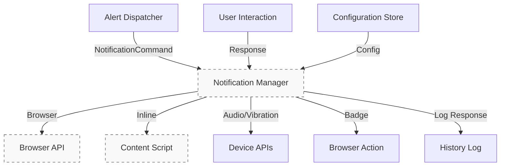

# Notification Manager — Architecture
## Purpose
Delivers notifications across channels based on commands from Alert Dispatcher. Manages lifecycle, queuing, and user interactions for alerts.

## Responsibilities
- Multi-channel delivery (browser, inline, audio, vibration)
- Lifecycle: create, update, dismiss
- Handle user responses and feedback
- Queue and consolidate concurrent notifications
- Ensure accessibility (ARIA, screen readers, keyboard)
- Optimize performance (lazy loading, cleanup)

## Dependencies
- API: `api/notification-command.api.md`, `api/notification-config.api.md`
- Components: `alert-dispatcher.md`, `ui-popup.md`, `configuration-store.md`, `history-log.md`

## Triggers
| Event                  | Source                       | Action                       |
|------------------------|------------------------------|------------------------------|
| Notification command   | `alert-dispatcher.md`        | `show(command)`              |
| User click/dismiss     | UI elements                  | `handleResponse()`           |
| Config change          | `configuration-store.md`     | `reloadConfig()`             |
| Cleanup interval       | Background timer             | `garbageCollect()`          |

## Flow

## Target Latencies
≤ 50 ms — show notification
≤ 10 ms — dismiss
≤ 100 ms — batch processing
≤ 5 ms — user response handling

## Implementation Notes

Manifest V3 compliant (async APIs, permissions)
Shadow DOM for inline warnings (style isolation)
Queuing: consolidation window (e.g., 5s)
Accessibility: ARIA roles, focus trap, screen reader announcements
Optimization: lazy import handlers, garbage collection (5min max age)
Permissions: "notifications", "activeTab"

## Related Documents

overview.md
api/notification-command.api.md
examples/notification-command.examples.md
alert-dispatcher.md
../../06-user-interaction/notification-types.md
../../05-implementation/apis-usage.md

Architecture only. No code. See api/ for schemas.