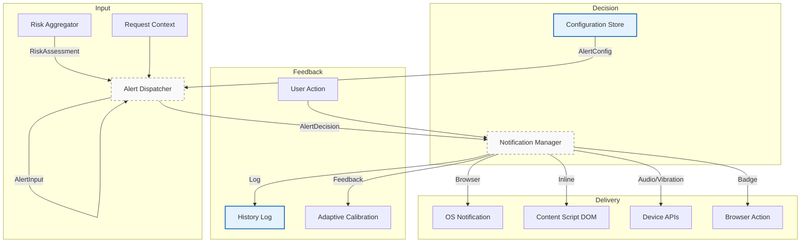
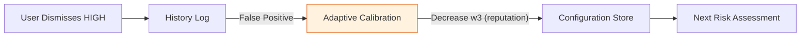

# Alert System — Overview  
**`03-architecture/alert-system/overview.md`**

## Purpose  
The **Alert System** is the user-facing defense layer of the phishing detection extension. It transforms internal risk assessments into **immediate, actionable, and accessible** protective responses — blocking threats, warning users, and collecting feedback to improve future detection.

The system operates as a **two-stage pipeline**:

```
Risk Aggregator → Alert Dispatcher → Notification Manager → User
```

All components are **decoupled via SSOT APIs**, ensuring no duplicated logic or data.

---

## Core Components

| Component | Responsibility | SSOT API |
|---------|----------------|----------|
| **`alert-dispatcher.md`** | Decision engine: maps risk + context → protective action | `api/alert-input.api.md` → `api/alert-decision.api.md` |
| **`notification-manager.md`** | Delivery engine: renders alerts across channels | `api/notification-command.api.md` |

---

## High-Level Flow



---

## Key Interfaces (SSOT)

| Interface | File | Purpose |
|---------|------|--------|
| `RiskAssessment` | `api/risk-assessment.api.md` | Output from Risk Aggregator |
| `AlertInput` | `api/alert-input.api.md` | Input to Alert Dispatcher |
| `AlertDecision` | `api/alert-decision.api.md` | Output from Dispatcher |
| `NotificationCommand` | `api/notification-command.api.md` | Input to Notification Manager |
| `AlertConfig` | `api/alert-config.api.md` | User preferences |
| `NotificationConfig` | `api/notification-config.api.md` | Channel settings |

> **No duplication** — all schemas referenced, never copied.

---

## Threat Response Strategies

| Risk Level | Action | Channels | User Options |
|----------|--------|----------|--------------|
| **CRITICAL** | Block + Warn | Modal, Browser, Audio | Proceed Anyway, Go Back, Whitelist |
| **HIGH** | Warn | Inline, Badge | Continue, Blacklist, Report FP |
| **MEDIUM** | Inform | Banner, Badge | Dismiss, View Details |
| **LOW** | Log | Background | None |

---

## Performance Targets

| Stage | Latency | Component |
|-------|---------|-----------|
| Decision | Less than or equal to 5 ms | `alert-dispatcher.md` |
| Dispatch | Less than or equal to 50 ms | `notification-manager.md` |
| User Response | Less than or equal to 10 ms | Event handlers |
| Cache Hit | Less than or equal to 1 ms | LRU decision cache |

---

## User Experience Principles

- **Non-intrusive by default**: Only CRITICAL threats block
- **Clear hierarchy**: Risk level → visual urgency
- **Accessible**: ARIA, keyboard navigation, screen reader support
- **Configurable**: Operation mode, thresholds, channels
- **Consolidated**: Low-priority alerts batched (5s window)

---

## Adaptive Learning Integration



- `FALSE_POSITIVE` → strong negative signal
- `CONFIRMED` → strong positive signal
- Response time used for feedback quality
- Changes logged as `WEIGHTS_UPDATED`

---

## Implementation Notes

- **Manifest V3**: Async APIs, no DOM blocking
- **Permissions**: `"notifications"`, `"activeTab"`, `"scripting"`
- **Channels**:
  - Browser: `chrome.notifications`
  - Inline: Shadow DOM + content script
  - Badge: `chrome.action.setBadgeText`
- **Queue**: Priority-based (P0–P3), batching for P2/P3
- **Cleanup**: Auto-dismiss after 5 min, DOM GC
- **Fallback**: Simple alert on API failure

---

## Related Documents

- `alert-dispatcher.md` — Decision logic
- `notification-manager.md` — Delivery channels
- `api/alert-input.api.md` — Input schema
- `api/alert-decision.api.md` — Decision schema
- `api/notification-command.api.md` — Command schema
- `examples/alert-decision.examples.md` — Sample decisions
- `examples/notification-command.examples.md` — Sample commands
- `../../02-mathematical-model/adaptive-calibration.md#formula-15` — Feedback loop
- `data-flow.md` — Full request lifecycle
- `component-interactions.md` — Event contracts
- `FILE_INDEX.md` — Registry
- `ROADMAP.md` — Planned: haptic patterns, voice alerts

---

*This file contains **only architectural overview**. No code, no duplicates. All facts via `api/`.*