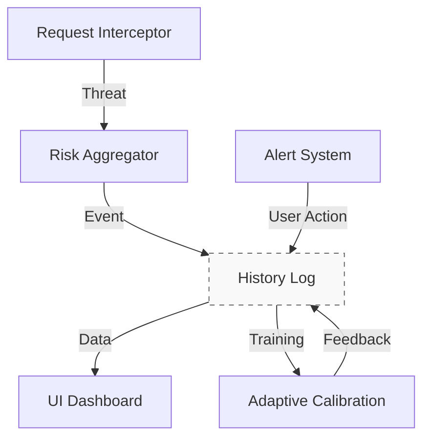

# History Log — Architecture
## Purpose
Maintains a complete audit of all events: threat detection, user actions, system decisions. Serves as a data source for
adaptive learning and analytics.

## Responsibilities
- Record events in chronological order
- Store metrics, weights, risk, decisions
- Support queries by domain, time, type
- Enforce retention policies
- Provide data for adaptive calibration
- Export anonymized data

## Dependencies
- API: `api/history-event.api.md`, `api/event-types.api.md`
- Components: `request-interceptor.md`, `risk-aggregator.md`, `adaptive-calibration.md`, `ui-dashboard.md`

## Triggers
| Event | Source | Action |
|------------------------|------------------------------|------------------------------|
| Threat detected | `risk-aggregator.md` | `logEvent(THREAT_DETECTED)` |
| User responded | `alert-system.md` | `recordUserAction()` |
| Weights updated | `adaptive-calibration.md` | `logEvent(WEIGHTS_UPDATED)` |
| Startup/shutdown | `background.md` | `logEvent(SYSTEM_STARTED)` |

## Flow

## Target Latencies
- ≤ 15 ms — event logging
- ≤ 50 ms — query last 50 events
- ≤ 200 ms — export 1000 events

## Implementation Notes
- Manifest V3
- `chrome.storage.local` (with batching)
- Indexes: by domain, date, type
- Anonymization on export
- Daily automatic cleanup

## Related Documents
- `overview.md`
- `api/history-event.api.md`
- `examples/history-event.examples.md`
- `../../02-mathematical-model/adaptive-calibration.md#formula-15`
---
*Architecture only. No code. See api/ for schemas.*