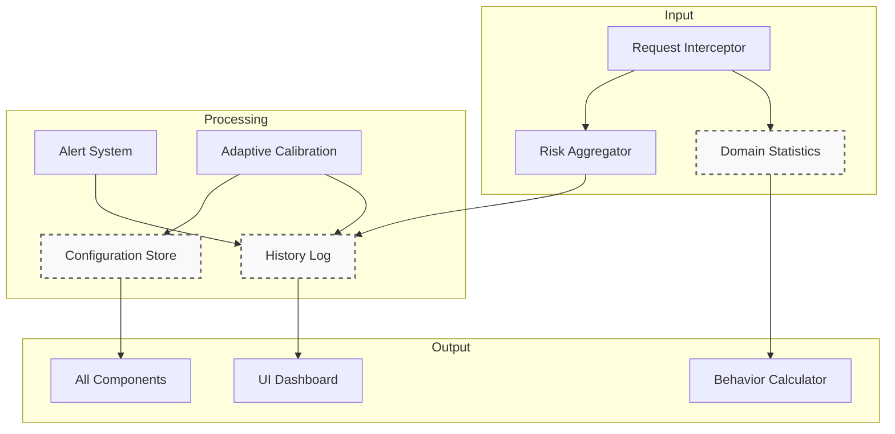

# Storage Layer — Overview  

## Purpose  
The **Storage Layer** is the single source of truth for all persistent and runtime data in the phishing-detection extension. It isolates storage concerns from business logic, ensures data consistency, enforces retention policies, and enables cross-component queries and adaptive learning.

The layer consists of three specialized stores that **never duplicate facts**:

| Store | Focus | SSOT Files |
|-------|-------|------------|
| **Configuration Store** | System settings, weights, thresholds, user preferences | `api/configuration.api.md` |
| **Domain Statistics** | Per-domain time-series, aggregates, behavioral profiles | `api/domain-profile.api.md` |
| **History Log** | Full audit trail of events, decisions, user feedback | `api/history-event.api.md`, `api/event-types.api.md` |

---

## Core Principles (SSOT + AI-Ready)

| Principle | Enforcement |
|---------|-------------|
| **One fact — one file** | All schemas in `api/`, referenced — never copied |
| **No code in architecture** | Only Mermaid, tables, latency targets |
| **Write-once, read-many** | Incremental updates, batching, caching |
| **Privacy by design** | No full URLs, anonymized exports, no PII in sync |
| **Manifest V3 compliant** | Async storage, alarms, background cleanup |

---

## High-Level Data Flow

---

## Component Interaction Matrix

| Component | Reads From | Writes To | Triggers |
|---------|------------|-----------|----------|
| `request-interceptor.md` | Config, Domain Stats | Domain Stats | `onRequestIntercepted` |
| `risk-aggregator.md` | Domain Stats, Config | History Log | `THREAT_DETECTED` |
| `alert-system.md` | History Log | History Log | `recordUserAction()` |
| `adaptive-calibration.md` | History Log | Config, History Log | `WEIGHTS_UPDATED` |
| `ui-dashboard.md` | History Log, Domain Stats | — | Queries |
| `background.md` | All | All | Startup, cleanup, sync |

---

## Key Interfaces (SSOT)

| Interface | File | Used By |
|---------|------|--------|
| `Configuration` | `api/configuration.api.md` | All components |
| `DomainProfile` | `api/domain-profile.api.md` | `domain-statistics.md`, `behavior-calculator.md` |
| `HistoryEvent` | `api/history-event.api.md` | `history-log.md`, `adaptive-calibration.md` |
| `EventType` | `api/event-types.api.md` | `history-log.md`, `alert-system.md` |

> **No interface duplication allowed** — see `FILE_INDEX.md`

---

## Performance & Retention

| Metric | Target | Component |
|--------|--------|-----------|
| Config load | ≤ 10 ms | `configuration-store.md` |
| Domain read (cache) | ≤ 0.5 ms | `domain-statistics.md` |
| Event write | ≤ 15 ms | `history-log.md` |
| Batch flush | ≤ 50 ms | All |
| Daily cleanup | ≤ 200 ms | Background |

| Policy | Scope | Retention |
|--------|-------|-----------|
| Active domains | `domain-statistics.md` | 30 days |
| High-risk events | `history-log.md` | Archive |
| Low-risk events | `history-log.md` | 7 days |
| Sync data | `configuration-store.md` | Indefinite (user prefs) |

---

## Adaptive Learning Integration

- Only `FALSE_POSITIVE` / `CONFIRMED` with `responseTime ∈ [2s, 5m]` used  
- Weights updated via **Formula 15–16** → `02-mathematical-model/adaptive-calibration.md`  
- Changes logged as `WEIGHTS_UPDATED` in History Log

---

## Implementation Notes

- **Storage Backend**: `chrome.storage.local` (all), `chrome.storage.sync` (prefs only)
- **Caching**: In-memory LRU + TTL per store
- **Batching**: 50 ops or 5s flush
- **Indexing**: Domain, date, type, risk level
- **Migration**: Schema-aware, versioned (`schemaVersion`)
- **Export**: Anonymized JSON (`hashDomain`, no UA, no tabId)

---

## Related Documents

- `configuration-store.md` — Settings & weights
- `domain-statistics.md` — Per-domain aggregates
- `history-log.md` — Audit & training data
- `api/configuration.api.md` — Config schema
- `api/domain-profile.api.md` — Domain schema
- `api/history-event.api.md` — Event schema
- `data-flow.md` — Full request lifecycle
- `component-interactions.md` — Event contracts
- `FILE_INDEX.md` — Registry of all SSOT files
- `ROADMAP.md` — Planned: ML-based profiling, cloud sync

---

*This file contains **only architectural overview**. No code, no duplicates. All facts referenced via `api/`.*