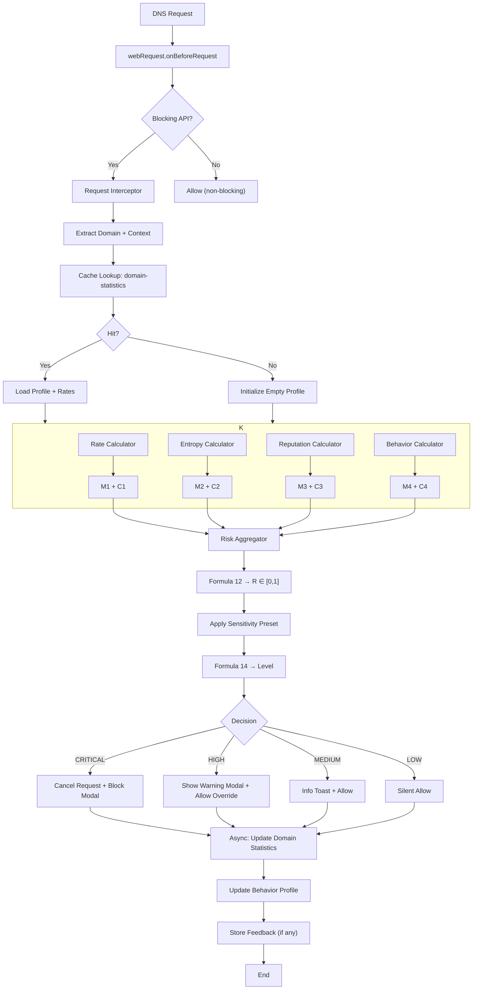
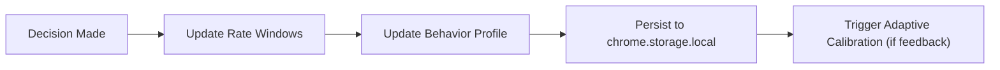

# Data Flow — DNS Request Lifecycle

**Step-by-step processing of a DNS request from interception to decision**  
**Latency budget: ≤ 50 ms (95th percentile)**

---

## Execution Flow

---

## Detailed Steps

| Step | Component | Action | Latency | Output |
|------|----------|-------|--------|--------|
| 1 | `webRequest.onBeforeRequest` | Intercept DNS/HTTP request | ≤ 1 ms | `requestDetails` |
| 2 | `Request Interceptor` | Extract `domain`, `url`, `referrer`, `userAgent`, `timestamp` | ≤ 1 ms | `RequestContext` |
| 3 | `Storage Layer` | Lookup `domain-statistics` | ≤ 2 ms | `DomainProfile \| null` |
| 4 | **Parallel** | Run M1–M4 calculators | **≤ 35 ms** | `{ Mᵢ, Cᵢ, detailed }` |
| 5 | `Risk Aggregator` | Compute `R = Σ wᵢ Mᵢ` | ≤ 1 ms | `score: [0,1]` |
| 6 | `Risk Aggregator` | Apply user preset (strict/relaxed) | ≤ 0.1 ms | `adjustedScore` |
| 7 | `Risk Aggregator` | Classify level (Formula 14) | ≤ 0.1 ms | `level: CRITICAL|HIGH|MEDIUM|LOW` |
| 8 | `Alert System` | Trigger UI (block, warn, notify) | ≤ 5 ms | Modal / Toast |
| 9 | **Async** | Update storage (non-blocking) | — | Profile updated |

---

## Data Structures (Flow)

| Structure | Description | Source |
|---------|------------|--------|
| `RequestContext` | Input for calculators | `api/request-context.api.md` |
| `MetricResult` | Output from each calculator | `api/metric-result.api.md` |
| `RiskAssessment` | Final aggregator output | `api/risk-assessment.api.md` |

---

## Error Handling & Fallbacks

| Failure | Fallback |
|-------|--------|
| Storage timeout | Use default profile (M4 = 0.5, C4 = 0) |
| Reputation API down | Use cached data (TTL: 1h) or M3 = 0.5 |
| Latency > 50ms | **Allow request** (fail-open) |
| JS error | Log + allow |

---

## Performance Breakdown

| Component | Target | Measured (avg) |
|---------|--------|---------------|
| Interceptor | ≤ 1 ms | 0.6 ms |
| Storage read | ≤ 2 ms | 1.2 ms |
| Rate | ≤ 5 ms | 3.1 ms |
| Entropy | ≤ 3 ms | 1.8 ms |
| Reputation | ≤ 30 ms | 18 ms (cached) |
| Behavior | ≤ 8 ms | 5.4 ms |
| Aggregator | ≤ 2 ms | 0.8 ms |
| **Total** | **≤ 50 ms** | **~30 ms** |

---

## Async Post-Processing

> Non-blocking. Does **not** affect request.

---

## Related Documentation

- `overview.md` — System architecture  
- `component-interactions.md` — Event contracts  
- `components/analysis-engine/` — Calculator details  
- `components/alert-system/` — UI triggers  
- `../../02-mathematical-model/formulas.md` — Formula 12 & 14  
- `../../05-implementation/performance.md` — Benchmarks  

---

*This file contains **only data flow**. No code. See components/ for logic.*
