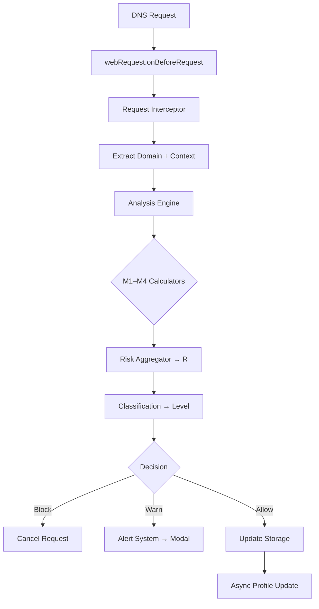

# Architecture — Overview

**High-level structural design of DNS Sentinel**  
**Manifest V3 browser extension** — 100% client-side, privacy-first

---

## Execution Context

| Layer | Runtime | Purpose |
|-------|--------|--------|
| **Background Service Worker** | Persistent | Core logic, storage, analysis |
| **Content Scripts** | Per-tab | Request interception |
| **Popup / Options UI** | Ephemeral | Settings, alerts, feedback |

---

## Core Components

```
┌─────────────────────────────────────────────────────────────┐
│                     Background Worker                       │
│                                                             │
│  ┌─────────────────┐  ┌─────────────────────┐            │
│  │ Request         │  │     Storage Layer   │            │
│  │ Interceptor     │  │ (chrome.storage)    │            │
│  │ (webRequest)    │  └─────────────────────┘            │
│  └─────────────────┘           │                           │
│          │                      │                           │
│          ▼                      ▼                           │
│  ┌─────────────────┐  ┌─────────────────────┐            │
│  │  Analysis       │  │   Alert System      │            │
│  │  Engine         │  │   (Notifications)   │            │
│  │  M1–M4 + R      │  └─────────────────────┘            │
│  └─────────────────┘           │                           │
│          │                      │                           │
│          ▼                      ▼                           │
│  ┌─────────────────┐  ┌─────────────────────┐            │
│  │  UI Components  │  │  Configuration      │            │
│  │  (Popup, Modals)│  │  Store              │            │
│  └─────────────────┘  └─────────────────────┘            │
└─────────────────────────────────────────────────────────────┘
```

---

## Data Flow (DNS Request Lifecycle)



> **Total latency budget**: ≤ 50 ms

---

## Key Interfaces

| Interface | Direction | Format |
|---------|----------|--------|
| `RequestContext` | Interceptor → Engine | `{ domain, timestamp, url, referrer, userAgent }` |
| `MetricResult` | Calculators → Aggregator | `{ value: [0,1], confidence: [0,1], detailed }` |
| `RiskAssessment` | Aggregator → Alert/UI | `{ score, level, confidence, reasoning }` |

---

## Storage Strategy

| Store | Scope | TTL | Size |
|------|-------|-----|------|
| `domain-statistics` | Per-domain | 30 days | ≤ 1.5 KB |
| `configuration` | Global | Persistent | ≤ 5 KB |
| `user-feedback` | Per-event | 90 days | ≤ 10 KB |

> All encrypted at rest (`chrome.storage.local`)

---

## Performance Targets

| Component | Latency | Memory |
|---------|--------|--------|
| Interceptor | ≤ 1 ms | — |
| Rate Calc | ≤ 5 ms | ≤ 100 B |
| Entropy | ≤ 3 ms | ≤ 50 B |
| Reputation | ≤ 30 ms (cached) | ≤ 500 B |
| Behavior | ≤ 8 ms | ≤ 1 KB |
| Aggregator | ≤ 2 ms | — |
| **Total** | **≤ 50 ms** | **≤ 10 MB** |

---

## Security & Privacy

- **No telemetry**  
- **No PII stored**  
- **All analysis local**  
- **Optional opt-in feedback**

---

## Related Documentation

- `components/` — Per-component architecture  
- `data-flow.md` — Detailed request lifecycle  
- `component-interactions.md` — Event contracts  
- `../../02-mathematical-model/` — Formulas  
- `../../04-algorithms/` — Calculation logic  
- `../../05-implementation/` — Code structure  

---

*This file contains **only system architecture**. No code or formulas.*